# Лабораторная работа 1.

# Создание финансовых калькуляторов

## Условие:
1. Создать каркас приложения-калькулятора. Приложение может быть написано на любом языке и технологии (десктопное, веб, мобильное, …). В интерфейсе (но не в заголовке окна) программы обязательно должны присутствовать: ФИО студента, курс, группа, год. Это написать русскими буквами.
2. Приложение должно позволять пользователю ввести два числа. И выбрать одну из двух операций: сложение или вычитание. Именно выбрать, а не вводить на клавиатуре «+» или «-».
3. Оба числа могут быть как положительными, так и отрицательными. Приложение должно подсчитывать сумму (разность) двух введенных чисел.
4. Обеспечить диапазон вводимых чисел и результата: не менее чем от минус 1 000 000 000 000.000000 до плюс 1 000 000 000 000.000000.  Если итоговый результат превышает указанный диапазон чисел, то допускается просто написать сообщение о переполнении. 
5. Для отделения дробной и целой части программа должна успешно принимать от пользователя как символ «точка», так и символ «запятая». Допускается автоматически менять ее на любой единый «удобный» вам разделитель (точку или запятую).
6. Обязательно должны работать комбинации Ctrl+C, Ctrl+V для вставки и  копирования чисел.
7. После вычислений цифры не должны пропадать (чтобы нужно было не заново вводить, а можно было изменить только часть цифр).
8. Калькулятор не должен выводить (или принимать на вход) числа в экспоненциальной нотации (например:123e+2)
9. При смене в операционной системе региональных настроек (разделителя чисел), программа должна по-прежнему корректно вычислять числа.

## Доп. условия:
1. Завернете ПО в docker контейнер и пришлете ссылку на docker hub.
2. Напишите понятную пошаговую инструкцию по установке (компиляции) или настройке на моем ноутбуке чего-то сложного (у меня установлены Windows 10, Mac OS и Ubuntu).

# Как запускать:
_Дисклеймер: лабораторная выполнялась и запускалась на Ubuntu 22.04._ 

Запустить [run.sh](run.sh): скрипт содержит в себе билд `docker` контейнера, а также запуск с правильными параметрами.
Параметры необходимы для корректной отработки фреймворка PyQt5. Команда запуска содержит необходимый bind к volume,
чтобы корректно отработал X11.

Результат:

# Шаг 1.

Интерфейс программы:

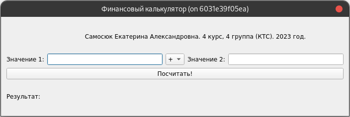

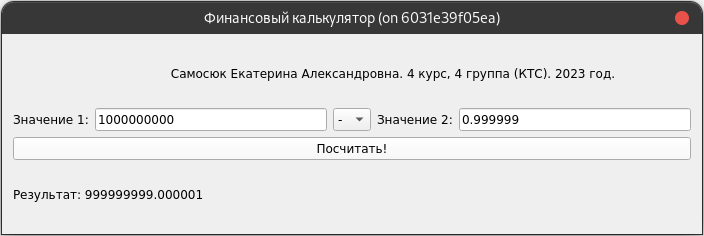

Работа с числами с запятой:

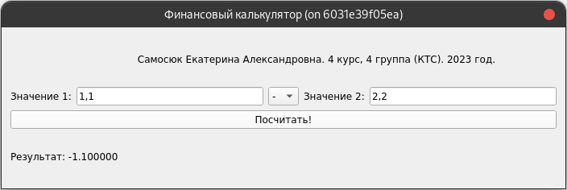

Ошибка при попытке ввести число в экспоненциальной нотации:

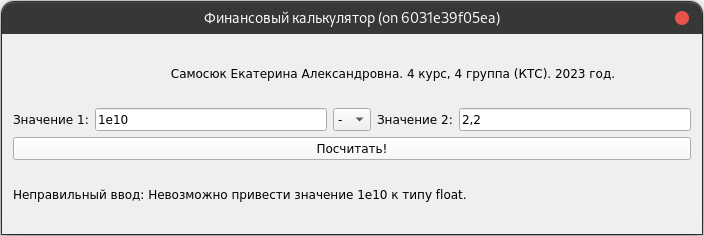

Переполнение:

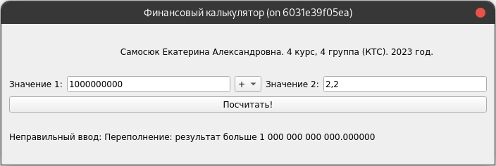
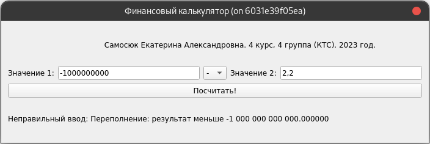
_Примечание: переполнение было искуственно добавлено проверкой в коде, т.к. Python поддерживает большие числа._

_P.s что-то климануло и поставила ограничения 1e9, хотя по условию 1e12. Бывает :)_
# Шаг 2.

Добавлена реализация умножения и деления:
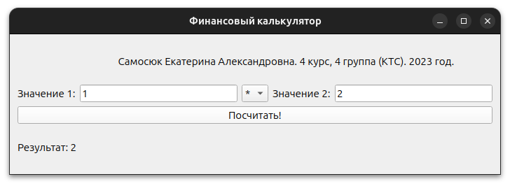

Обработка деления на 0:
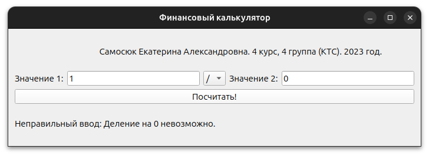

Введена поддержка разделения разрядов, причем используется регулярное выражение для этого.
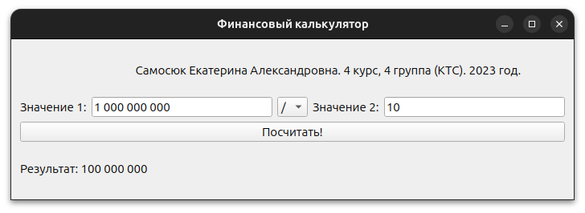

Также регулярка позволяет не обрабатывать буквы.
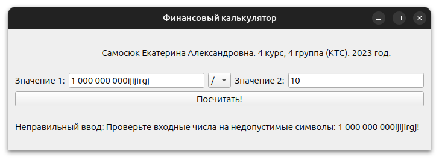

# Шаг 3.
Добавлено 4 операнда с возможностью выбрать операцию для каждой пары. В интерфейсе также отображены скобки, т.к. по условию
задачи числа 2 и 3 обрабатываются с высшим приоритетом.
Также добавлена возможность выбрать тип округления.

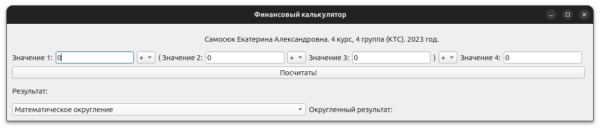

Для остальных операций сохранён приоритет математических операций:
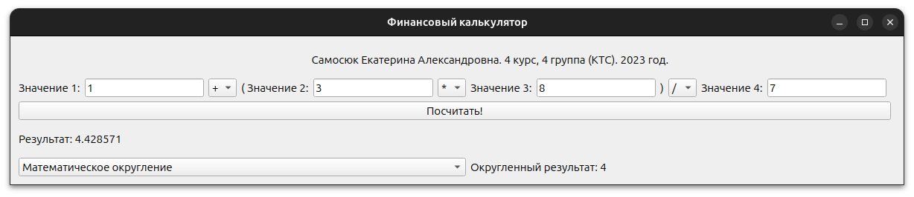

