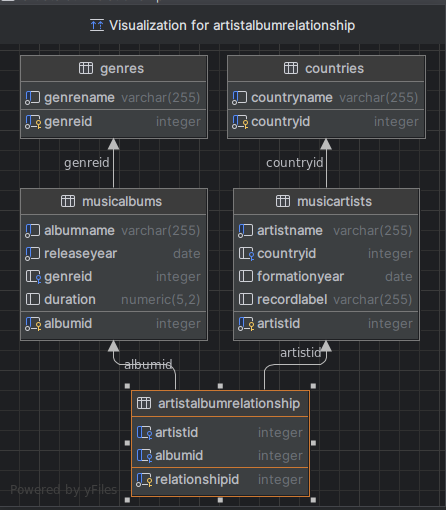
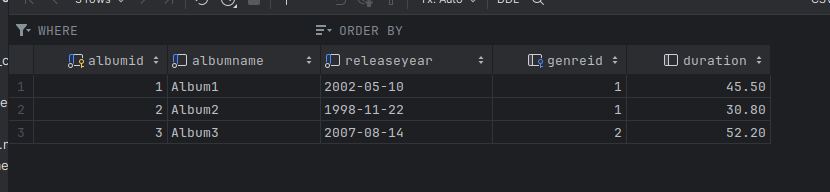
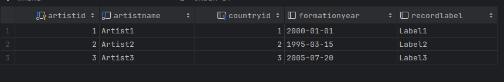

# Лабораторная работа 2. Разработка модуля справочной информации бизнес-приложения
## Шаг 1. Справочники
В моей работе используются справочники "Музыкальные артисты" и "Музыкальные альбомы".
Структура представлена в таблицах:

Музыкальные альбомы: 

| Поле                      | Тип данных            | Описание                                 |
|---------------------------|-----------------------|------------------------------------------|
| Идентификатор             | Целое число           | Уникальный идентификатор альбома         |
| Название                  | Текстовая строка      | Название музыкального альбома            |
| Идентификатор исполнителя | Целое число           | Имя или название исполнителя             |
| Жанр                      | Текстовая строка      | Жанр музыки, к которому относится альбом |
| Год выпуска               | Дата                  | Год выпуска альбома                      |
| Продолжительность         | Число с фикс. запятой | Продолжительность альбома в минутах      |

Музыкальные исполнители:

| Поле               | Тип данных       | Описание                                  |
|--------------------|------------------|-------------------------------------------|
| Идентификатор      | Целое число      | Уникальный идентификатор исполнителя      |
| Имя                | Текстовая строка | Имя или название исполнителя              |
| Страна             | Текстовая строка | Страна происхождения исполнителя          |
| Год начала карьеры | Дата             | Год образования группы или начала карьеры |
| Жанр               | Текстовая строка | Основной жанр музыки, который исполняет   |

Связь справочников представлена связью Исполнитель (идентификатор) - Альбом (идентификатор исполнителя).

## Шаг 2. Создание и заполнение БД.

Один исполнитель может написать много альбомов, а один альбом может принадлежать нескольким авторам. Т.к. на лицо
связь many-to-many, то добавим ещё одну дополнительную таблицу для реализации такого типа связи.

Также я решила добавить отдельные таблицы для стран и жанров, т.е. сделать своего рода enum.

Для дальнейшей работы будет использоваться СУБД Postgesql. Образ данной СУБД поднимается в Docker-контейнере с помощью
утилиты docker-compose. 

Код для создания таблиц представлен в файле [init.sql](sql%2Finit.sql). 

В результате заполнения таблиц получим следующее:

