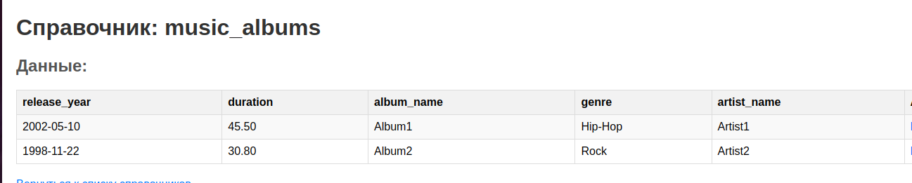

# Лабораторная работа 2. Разработка модуля справочной информации бизнес-приложения
## Шаг 1. Справочники
В моей работе используются справочники "Музыкальные артисты" и "Музыкальные альбомы".
Структура представлена в таблицах:

Музыкальные альбомы: 

| Поле                      | Тип данных            | Описание                                 |
|---------------------------|-----------------------|------------------------------------------|
| Идентификатор             | Целое число           | Уникальный идентификатор альбома         |
| Название                  | Текстовая строка      | Название музыкального альбома            |
| Идентификатор исполнителя | Целое число           | Имя или название исполнителя             |
| Жанр                      | Текстовая строка      | Жанр музыки, к которому относится альбом |
| Год выпуска               | Дата                  | Год выпуска альбома                      |
| Продолжительность         | Число с фикс. запятой | Продолжительность альбома в минутах      |

Музыкальные исполнители:

| Поле               | Тип данных       | Описание                                  |
|--------------------|------------------|-------------------------------------------|
| Идентификатор      | Целое число      | Уникальный идентификатор исполнителя      |
| Имя                | Текстовая строка | Имя или название исполнителя              |
| Страна             | Текстовая строка | Страна происхождения исполнителя          |
| Год начала карьеры | Дата             | Год образования группы или начала карьеры |
| Жанр               | Текстовая строка | Основной жанр музыки, который исполняет   |

Связь справочников представлена связью Исполнитель (идентификатор) - Альбом (идентификатор исполнителя).


## Шаг 2. Создание и заполнение БД.


Для дальнейшей работы будет использоваться СУБД Postgesql. Образ данной СУБД поднимается в Docker-контейнере с помощью
утилиты docker-compose. 

Код для создания таблиц представлен в файле [init.sql](sql%2Finit.sql). 

В результате заполнения таблиц получим следующее:


## Шаг 3. Разработка приложения
Для работы я выбрала фреймворк Flask (Python). С помощью него возможно быстро построить простой web-приложение.

### Интерфейс:
- Просмотр и выбор справочника:


- Просмотр данных справочника: 
[img_6.png](images/img_6.png)

- Добавление записи: 

Добавлена валидация дат, чисел и тп.


- Редактирование записи: 


- Удаление записи:


Отмечу, что все foreign keys также отображаются в таблицах, причем не просто id,
на который ссылается запись, а на осмысленное имя: 


При редактировании и добавлении новой записи для foreign key отображается список из
доступных вариантов: 


## Шаг 4. Бонус!
Архитектура данного приложения построена так, что код работает с любой таблицей и не 
зависит от конкретной реализации таблицы.

Для этого я использую некоторые таблицы с метаданными из Postgres, а также собственную таблицу
`table_names_aliases`.


В коде эта таблица используется в качестве словаря для "алиасов": id я заменяю на осознанные названия.

Также я создала несколько view для отслеживания зависимостей между таблицами. Именно на этих вью
и построена вся логика правильного отображения всех полей для таблиц, где есть foreign key.

Для тестирования я создала ещё одну таблицу `music_awards`:


И внесла доп. запись в таблицу 
`table_names_aliases`.

Теперь на главной странице отображается и эта таблица, ~~без мам, пап и кредитов~~ без изменений кода приложения. 
Можно делать всё то же самое, что и с первыми двумя.


## Запуск приложения
Для удобства написан Makefile.
Для запуска сервера:
 ```bash
 make run-web
 ```
Для запуска Postgresql:
 ```bash
 make run-db
 ```
Для добавления доп. таблицы:
```bash
add-sql
```
Для остановки:
 ```bash
 make stop
 ```
Очистка volumes:
 ```bash
 make clean-volumes
 ```

